DS202 Final Project
================
Alex Mears

# Misinformation: The Most Dangerous Occupational Hazard

## Introduction

For this project, I will be examining the [**Career Explorer
Occupational Level Data**](https://data.iowa.gov/catalog/dataset/1192)
data set to get some insights into the job market in Iowa. This data set
is created and managed by the Iowa Workforce Development agency, and it
is updated every year. So the data is comprehensive, clean, and up to
date.

This data set compiles information about different jobs across Iowa. It
is incredibly large, at 40048 rows and 91 columns. The data set includes
information about current job markets, predicted future changes in those
markets, education requirements, desired skills, and much more. For a
full breakdown of each column, check out the link above, and click on
the ‘Columns’ tab. Since there are so many, I will not go into detail on
each one, but I will describe below the ones I most often use in my
research. Otherwise I will describe columns as I use them.

1.  geography - County location of data point.
2.  occupational_title - Title of occupation.
3.  estimated_employment - Estimated number of current jobs for
    occupation in geographical location.
4.  projected_employment - Projected number of future jobs for
    occupation in geographical location.
5.  average_annual_salary - Average annual salary of occupation in
    geographical location.
6.  typical_education_requirement - Typical education requirement for
    occupation.
7.  on_the_job_training_requirement - Typical on the job training
    requirement for occupation.
8.  skill_def - Short descriptive definition of the top skill for
    occupation.
9.  skill_type - Type of skill that skill_def is categorized by.

## Initial Overview

Firstly, I want to take a look at some of the more ‘basic’ explorations.

### How many different jobs are there?

``` r
cat('There are', 
    df |> select(occupational_title) |> unique()|> nrow(),
    'unique occupational titles')
```

    ## There are 604 unique occupational titles

### How many years does this data set cover?

The data set has a few different columns related to years.
`estimated_employment_year` gives the year that `estimated_employment`
was estimated. `projected_employment_year` gives the year for the
`projected_employment`. `wage_year` identifies the year when the wage
data was collected.

``` r
df |> select(wage_year) |> unique()
```

    ##   wage_year
    ## 1      2024

``` r
df |> select(estimated_employment_year) |> unique()
```

    ##   estimated_employment_year
    ## 1                      2022

``` r
df |> select(projected_employment_year) |> unique()
```

    ##   projected_employment_year
    ## 1                      2032

For all three columns, they each have one unique value. For all jobs,
the `estimated_employment` was collected in 2022, `projected_employment`
is for 2032, and wages were collected in 2024.

### What does the average salary distribution look like?

For these next few, I will just look at rows with
`geography == 'State of Iowa'`. Since this is just a basic exploration
of the data, I don’t want to get too in the weeds quite yet. In my more
advanced exploration I will be exploring the data as it relates to
counties in Iowa.

``` r
dfia <- df |> filter(geography == 'State of Iowa')
```

``` r
dfia |> select(average_annual_salary) |> ggplot(aes(x = average_annual_salary)) + geom_histogram(bins = 100) + scale_x_continuous(labels = label_comma(), n.breaks = 10)+labs(x='Average annual salary', y='Number of jobs', title = 'State of Iowa Annual Salary Histogram')
```

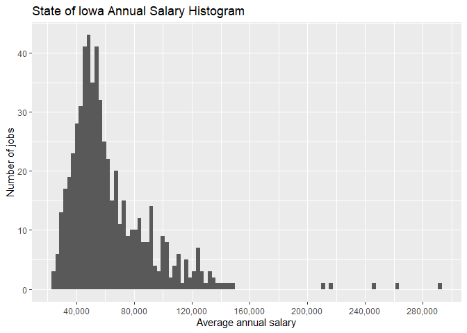<!-- -->

``` r
dfia |> select(average_annual_salary) |> summary()
```

    ##  average_annual_salary
    ##  Min.   : 24134       
    ##  1st Qu.: 44746       
    ##  Median : 54930       
    ##  Mean   : 63174       
    ##  3rd Qu.: 73159       
    ##  Max.   :292030       
    ##  NAs    :3

From this histogram and the summary we see that most jobs fall within
the 25,000 - 80,000 range, with a few large outliers.

### What jobs have the most employment? Which have the least?

``` r
search_max_min <- dfia |> select(occupational_title, estimated_employment) 
search_max_min[which.max(search_max_min$estimated_employment), ]
```

    ##                                  occupational_title estimated_employment
    ## 212 Farmers, Ranchers, & Other Agricultural Manager                86365

``` r
search_max_min[which.min(search_max_min$estimated_employment), ]
```

    ##               occupational_title estimated_employment
    ## 350 Motion Picture Projectionist                   85

Understandably, the job with the highest employment is
`Farmers, Ranchers, & Other Agricultural Manager` with 86,365 jobs. The
job with the lowest employment is `Motion Picture Projectionist`, with
only 85 jobs.

### What are the most common top ranked skills?

``` r
dfia |> select(skill_def, skill_type) |> 
  ggplot(aes(x=fct_rev(fct_infreq(skill_def)), fill = skill_type)) + 
  geom_bar() + coord_flip() +
  geom_text(
    stat = 'count',
    aes(label = after_stat(count)),
    vjust = 0.4,
    hjust = 1.1,
    size = 3
  )+labs(x='Skill', y='Number of jobs', title = 'Distribution of Top Skills')
```

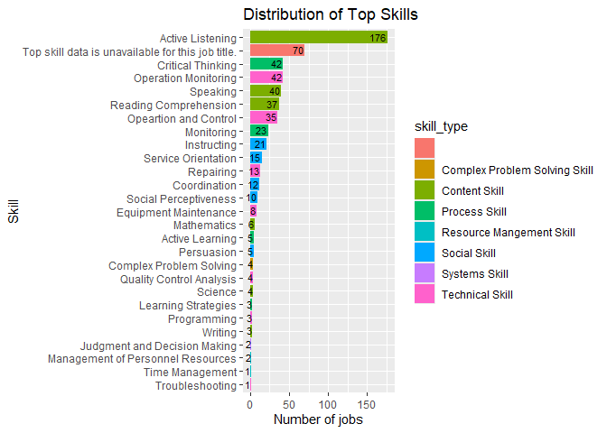<!-- -->

The most frequent top skill is `Active Listening` by a large margin. The
next highest skill is Critical Thinking, with 134 less jobs listing it
as the top skill. Most interestingly though, is that 70 jobs didn’t have
a skill listed. Those jobs being:

``` r
dfia |> filter(top_skill_code == 'N.A.') |> select(occupational_title)
```

    ##                                                                         occupational_title
    ## 1                                                                               Legislator
    ## 2                                                                      Fundraising Manager
    ## 3                                                       Education Administrator, All Other
    ## 4                                      Entertainment & Recreation Manager, Except Gambling
    ## 5                                                                 Personal Service Manager
    ## 6                                                                       Manager, All Other
    ## 7                                                            Project Management Specialist
    ## 8                                               Business Operations Specialist, All Other 
    ## 9                                                         Financial and Investment Analyst
    ## 10                                                               Financial Risk Specialist
    ## 11                                                         Financial Specialist, All Other
    ## 12                                                                      Software Developer
    ## 13                                                      Web and Digital Interface Designer
    ## 14                                                          Computer Occupation, All Other
    ## 15                                                                          Data Scientist
    ## 16                                                                     Engineer, All Other
    ## 17                      Engineering Technologist and Technician, Except Drafter, All Other
    ## 18                                                         Biological Scientist, All Other
    ## 19                                  Life, Physical, & Social Science Technician, All Other
    ## 20                                                                Social Worker, All Other
    ## 21                                        Community & Social Service Specialist, All Other
    ## 22                                                             Religious Worker, All Other
    ## 23                                                         Legal Support Worker, All Other
    ## 24                                       Social Sciences Teacher, Postsecondary, All Other
    ## 25                                                        Postsecondary Teacher, All Other
    ## 26                                                    Special Education Teacher, All Other
    ## 27                                                          Substitute Teacher, Short-Term
    ## 28                                                       Teacher and Instructor, All Other
    ## 29                                        Education, Training, & Library Worker, All Other
    ## 30                                     Media and Communication Equipment Worker, All Other
    ## 31                                                                    Physician, All Other
    ## 32                               Healthcare Diagnosing or Treating Practitioner, All Other
    ## 33                                                                               Paramedic
    ## 34                                                              Medical Records Specialist
    ## 35                                           Health Technologist and Technician, All Other
    ## 36                                Healthcare Practitioner and Technical Worker, All Other 
    ## 37                                                    Healthcare Support Worker, All Other
    ## 38                                               First-Line Supervisor of Security Workers
    ## 39                          First-Line Supervisor of Protective Service Workers, All Other
    ## 40                                                                      School Bus Monitor
    ## 41                                                    Protective Service Worker, All Other
    ## 42                                                                         Cook, All Other
    ## 43                                    Food Preparation & Serving Related Worker, All Other
    ## 44                                                     Building Cleaning Worker, All Other
    ## 45                                                   Grounds Maintenance Worker, All Other
    ## 46 First-Line Supervisor of Entertainment and Recreation Workers, Except Gambling Services
    ## 47                                                      Gambling Service Worker, All Other
    ## 48                                   Entertainment Attendant and Related Worker, All Other
    ## 49                                             Personal Care and Service Worker, All Other
    ## 50         Sales Representative of Services, Except Advertising/Insurance/Financial/Travel
    ## 51                                                       Sales & Related Worker, All Other
    ## 52                                                              Financial Clerk, All Other
    ## 53                                                   Information & Record Clerk, All Other
    ## 54                                       Office & Administrative Support Worker, All Other
    ## 55                                                          Agricultural Worker, All Other
    ## 56                                                  Helper--Construction Trades, All Other
    ## 57                                             Miscellaneous Construction & Related Worker
    ## 58                                   Installation, Maintenance, & Repair Worker, All Other
    ## 59                                                    Miscellaneous Assembler & Fabricator
    ## 60                                                       Food Processing Worker, All Other
    ## 61                                                Metal Worker & Plastic Worker, All Other
    ## 62                                                                  Wood Worker, All Other
    ## 63                                                      Plant & System Operator, All Other
    ## 64                                                            Production Worker, All Other
    ## 65  First-Line Supervisor of Transportation/Material Moving Workers, Except Aircraft Cargo
    ## 66                                                                      Bus Driver, School
    ## 67                                                            Shuttle Driver and Chauffeur
    ## 68                                                       Motor Vehicle Operator, All Other
    ## 69                                                              Aircraft Service Attendant
    ## 70                                                       Material Moving Worker, All Other

When looking at the jobs without listed skills, we see some pretty
popular roles listed. For example, `Social Worker` is a job without a
listed skill, but I would think that something like `Active Listening`
would absolutely be one of the top skills for that role.

Ironically enough, one of the jobs without skill listed is
`Data Scientist`.

### What are typical education requirements?

``` r
dfia |> select(typical_education_requirement) |> ggplot(aes(fct_rev(fct_infreq(typical_education_requirement)))) + geom_bar() + coord_flip()+labs(x='Education Requirement', y='Unique Jobs', title = 'Minimum Education Requirement')
```

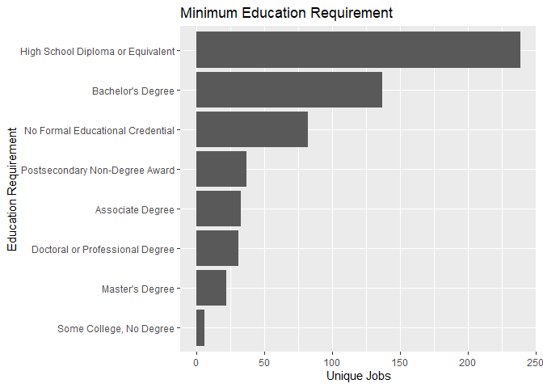<!-- -->

We see that `High School Diploma or Equivalent` is good enough to get
you the majority of jobs in the state. Following that is
`Bachelor's Degree`, and then `No Formal Educational Credential`. The
rest of the educational levels have much fewer jobs, with the least
being `Some College, No Degree`.

## Projected Future Exploration

One of the features of this data set is the projected growth data. The
`projected_employment` column provides an estimation for the amount of
jobs in 2032. Using this column, I want to explore what the future job
market is expected to look like.

Initially, let’s just explore what jobs are expected to have the most
growth.

``` r
# What jobs have the most projected growth/employment? What skills, education, training is required. 
dffut <- df |> mutate(deljobs = projected_employment - estimated_employment) |> slice_max(order_by = deljobs, n = 100) # Creating df with 100 highest growing jobs (jobs with most projected new openings) 
dffut |> select(geography,occupational_title,deljobs) |> head(10)
```

    ##        geography                               occupational_title deljobs
    ## 1  State of Iowa                 Home Health & Personal Care Aide    7385
    ## 2  State of Iowa             Heavy & Tractor-Trailer Truck Driver    6045
    ## 3  State of Iowa                                 Registered Nurse    3575
    ## 4  State of Iowa                           Stocker & Order Filler    3125
    ## 5  State of Iowa Laborer & Freight, Stock, & Material Mover, Hand    2980
    ## 6  State of Iowa                                 Cook, Restaurant    2650
    ## 7  State of Iowa                                Nursing Assistant    2285
    ## 8  State of Iowa                             Construction Laborer    2160
    ## 9  State of Iowa                Medical & Health Services Manager    2155
    ## 10         Boone                 Home Health & Personal Care Aide    1980

Just looking at the top 10, we see a wide variety of jobs. Notably 5 of
the top 10 are in the healthcare/hospitality sector. The rest of the top
10 are spread out across more ‘blue collar’ sectors.

### What are the projected top skills, education, and training for the future?

``` r
dffut|> select(skill_def, skill_type) |>    ggplot(aes(x=fct_rev(fct_infreq(skill_def)), fill = skill_type)) +    geom_bar() + coord_flip() +   geom_text(     stat = 'count',     aes(label = after_stat(count)),     vjust = 0.4,     hjust = 1.1,     size = 3   )+labs(x='Skill', y='Unique Jobs', title = 'Future Distribution of Top Skills')
```

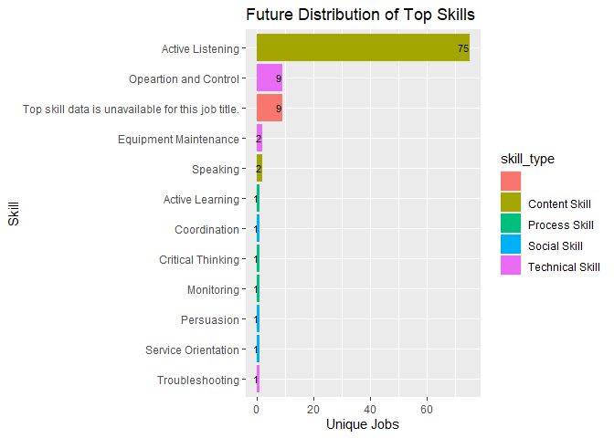<!-- -->

Here we can see an overwhelming need for `Active Listening` in the
future. This isn’t too surprising, since earlier we found
`Active Listening` to be the most frequent top skill for the present
day.

``` r
dffut |> select(typical_education_requirement) |> ggplot(aes(x=fct_rev(fct_infreq(typical_education_requirement)))) + geom_bar() + coord_flip()+labs(x='Education Requirement', y='Unique Jobs', title = 'Future Minimum Education Requirement by Unique Jobs')
```

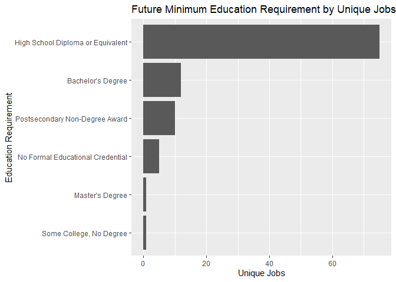<!-- -->

Again, only a `High School Diploma or Equivalent` is needed for most of
the highest growing jobs, which was true for present day jobs. This
chart only counts the number of occupations with these education
requirements. This may skew the data a bit, since we saw 5 of the top 10
jobs were in healthcare, which requires more than a High School Diploma.
What does it look like if we compare it to the number of projected jobs
instead?

``` r
dffut |> summarize(tot_jobs = sum(projected_employment), .by=typical_education_requirement) |> ggplot(aes(x=reorder(typical_education_requirement,tot_jobs), y=tot_jobs))+geom_col()+coord_flip()+labs(x='Education Requirement', y='Total Number of Jobs', title = 'Future Minimum Education Requirement by Total Number of Jobs')+scale_y_continuous(labels = label_number())
```

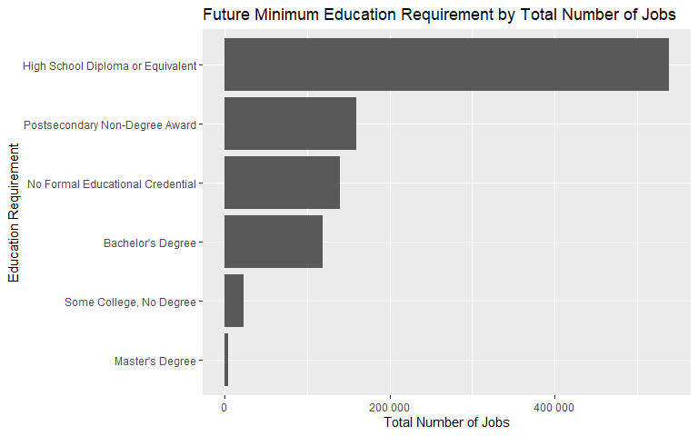<!-- -->

We still see `High School Diploma or Equivalent` as the largest
requirement, but `Postsecondary Non-Degree Award` has crept up into the
second spot.

``` r
dffut |> select(on_the_job_training_requirement) |> ggplot(aes(x=on_the_job_training_requirement)) + geom_bar() + coord_flip()+labs(x='On the Job Training Requirement', y='Unique Jobs', title = 'Future On the Job Training Requirements by Unique Jobs')
```

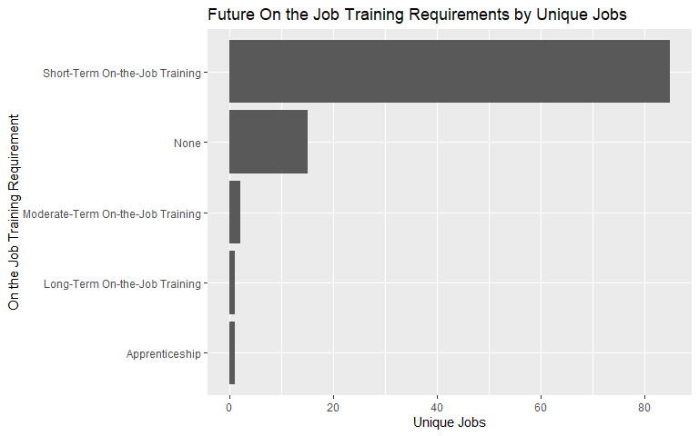<!-- -->

This graph clearly shows that most of the highest growing jobs require
`Short-Term On-the-Job Training`. This follows from our previous graphs.
If most jobs only require a `High School Diploma or Equivalent`, and no
exceptionally technical skills, the jobs would require some training,
but not a large amount.

Again, this graph charts the training requirements to the number of
occupations, not the number of projected jobs.

``` r
dffut |> summarize(tot_jobs = sum(projected_employment), .by = on_the_job_training_requirement)|> ggplot(aes(x=on_the_job_training_requirement, y=tot_jobs)) + geom_col() + coord_flip()+labs(x='On the Job Training Requirement', y='Total Future Jobs', title = 'Future On the Job Training Requirements by Total Jobs')+scale_y_continuous(labels = label_number())
```

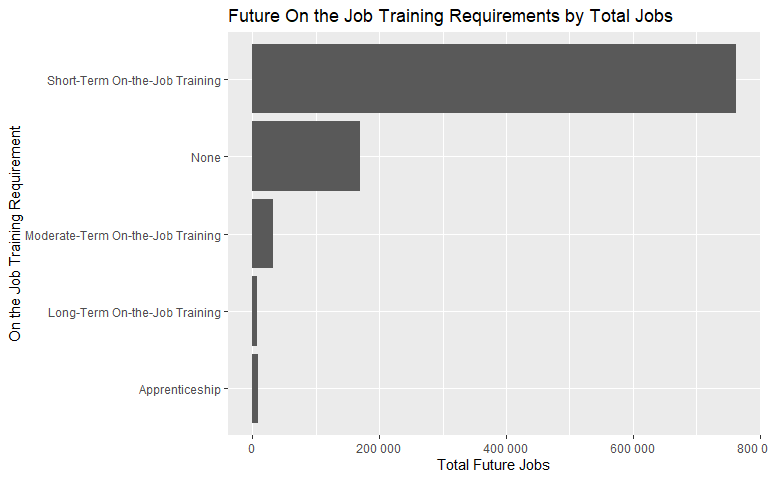<!-- -->

Modifying the graph to look at the total projected jobs, there is
virtually no difference.

In summary, the Iowa job market is predicted to grow most in jobs with
lower education requirements, focusing on short term training, with
lower technical skill requirements.

## Personal Market Analysis

The primary goal of this project is to explore the Iowa job market in a
way that gives me a good insight into my future work environments. To
this end, I want to specifically look at two factors, location and
occupation.

### Part 1: Location

I am a person who is naturally drawn to more populated areas, so I want
to explore what the markets look like in larger counties. For this
exploration, I will be looking at counties with a population over
100,000.

``` r
# Scraping wikipedia for county data

counties <- "https://en.wikipedia.org/wiki/List_of_counties_in_Iowa" |> read_html() |> html_table(fill=T) # Scraping wiki page for tables

IaCount <- counties[[2]] |> select(County, `Population[13]`, `Area[4]`) # Selecting table and useful columns

IaCount <- IaCount |> rename(Population = `Population[13]`, Area = `Area[4]`) # Renaming columns

IaCount$Population <- parse_number(IaCount$Population) # Setting `Population` to numeric values

IaCount$County <- IaCount$County |> str_replace(' County', '') # Getting rid of the word County, to match with other df
```

``` r
bigPop <- IaCount |> filter(Population >= 100000) # Creating df with just counties with population >= 100,000
```

``` r
dflarge <- df |> filter(
  geography %in% bigPop$County
) # Filtering our dataset to only include the large counties
```

Initially, I just want to explore what the general job market looks
like. To start, let’s look at annual salary.

``` r
dflarge |> select(average_annual_salary) |> ggplot(aes(x = average_annual_salary)) + geom_histogram(bins = 100) + scale_x_continuous(labels = label_comma(), n.breaks = 10)+labs(x='Annual Salary', y='Number of Jobs', title = 'Annual Salary Histogram of Most Populus Counties')
```

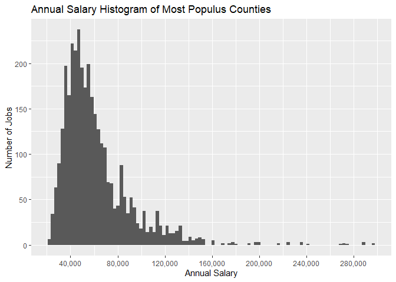<!-- -->

``` r
dflarge |> select(average_annual_salary) |> summary()
```

    ##  average_annual_salary
    ##  Min.   : 22098       
    ##  1st Qu.: 42195       
    ##  Median : 53887       
    ##  Mean   : 61456       
    ##  3rd Qu.: 70509       
    ##  Max.   :296697       
    ##  NAs    :174

The histogram and summary paint a very similar picture to our previous
examination of the entire state of Iowa. However, our initial look used
the data with `geography == State of Iowa`. What does the histogram and
summary look like if we open it up to the entire data set?

``` r
df |> select(average_annual_salary) |> ggplot(aes(x = average_annual_salary)) + geom_histogram(bins = 100) + scale_x_continuous(labels = label_comma(), n.breaks = 10)+labs(x='Annual Salary', y='Number of Jobs', title = 'Annual Salary Histogram of all Counties')
```

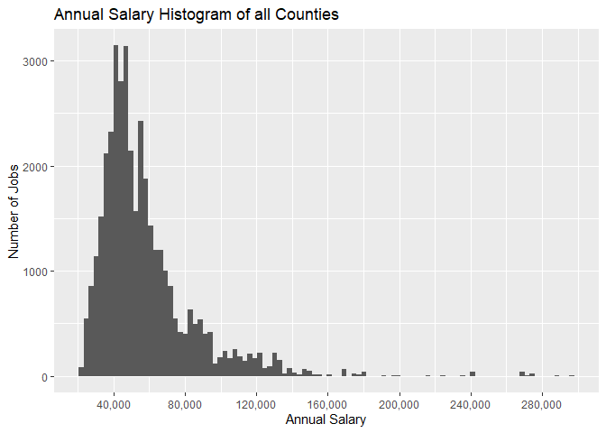<!-- -->

``` r
df |> select(average_annual_salary) |> summary()
```

    ##  average_annual_salary
    ##  Min.   : 22037       
    ##  1st Qu.: 40774       
    ##  Median : 50546       
    ##  Mean   : 57783       
    ##  3rd Qu.: 65812       
    ##  Max.   :296697       
    ##  NAs    :1834

Again, it is nearly identical. So we can say that the salary
expectations and tendencies do not change when comparing the overall
state to the larger counties. Just for fun, what do these graphs look
like when looking at the smallest counties?

``` r
smallPop <- IaCount |> filter(Population <= 10000)

dfsmall <- df |> filter(geography %in% smallPop$County)

dfsmall |> select(average_annual_salary) |> ggplot(aes(x = average_annual_salary)) + geom_histogram(bins = 100) + scale_x_continuous(labels = label_comma(), n.breaks = 10)+labs(x='Annual Salary', y='Number of Jobs', title = 'Annual Salary Histogram of Least Populus Counties')
```

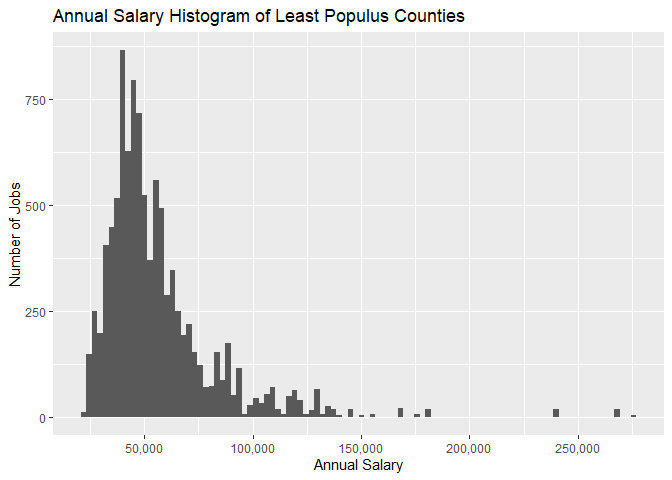<!-- -->

``` r
dfsmall |> select(average_annual_salary) |> summary()
```

    ##  average_annual_salary
    ##  Min.   : 22037       
    ##  1st Qu.: 40307       
    ##  Median : 48528       
    ##  Mean   : 56059       
    ##  3rd Qu.: 63273       
    ##  Max.   :275703       
    ##  NAs    :501

While the smaller counties are slightly shifted to the left, it is
basically negligible. Overall, we can see that the market doesn’t change
significantly depending on which counties we are looking at, at least
when looking at annual salary.

Getting more specific, what does the market look like in terms of
individual occupations in the larger counties?

``` r
cursaljob <- dflarge |> summarize(
  .by=occupational_title,
  avg_salary = mean(average_annual_salary,na.rm=T),
  number_of_jobs = sum(estimated_employment)
)
cursaljob |> arrange(desc(avg_salary)) |> head(10)
```

    ##                     occupational_title avg_salary number_of_jobs
    ## 1            Family Medicine Physician   278796.4           2515
    ## 2                 Physician, All Other   257418.7           3170
    ## 3                    Musician & Singer   224848.0            520
    ## 4                    Nurse Anesthetist   215863.0            260
    ## 5                     Dentist, General   188583.2           1430
    ## 6                      Chief Executive   182067.2           5635
    ## 7  Architectural & Engineering Manager   147106.1           3785
    ## 8                        Sales Manager   145163.5           5055
    ## 9   Engineering Teacher, Postsecondary   144120.0           1240
    ## 10            Natural Sciences Manager   144071.0            705

``` r
cursaljob |> arrange(desc(number_of_jobs)) |> head(10)
```

    ##                                       occupational_title avg_salary
    ## 1                                                Cashier   28893.50
    ## 2                   Heavy & Tractor-Trailer Truck Driver   54250.62
    ## 3                             Fast Food & Counter Worker   28210.12
    ## 4                                     Retail Salesperson   33700.75
    ## 5                                       Registered Nurse   75060.25
    ## 6        Farmers, Ranchers, & Other Agricultural Manager   94687.29
    ## 7                        Customer Service Representative   43893.25
    ## 8                                  Office Clerk, General   42381.62
    ## 9       Laborer & Freight, Stock, & Material Mover, Hand   41102.00
    ## 10 Janitor & Cleaner, Except Maid & Housekeeping Cleaner   35220.12
    ##    number_of_jobs
    ## 1           73680
    ## 2           66780
    ## 3           62740
    ## 4           61615
    ## 5           59185
    ## 6           55480
    ## 7           53915
    ## 8           50675
    ## 9           48945
    ## 10          43910

From looking at the highest paid occupations, we see a lot of healthcare
and engineering roles. The only surprising occupation to me is
`Musician & Singer`, which is surely skewed by a few large artists.

Looking at most number of jobs, again we see a lot of high volume, low
education and training requirement, hands on jobs. Interestingly though,
some of these jobs have a fairly high average salary, with
`Farmers, Ranchers, & Other Agricultrual Manager` nearing 6 figures.

The ultimate takeaway from this analysis is that the job market as a
whole, in Iowa, doesn’t really change when looking at different
locations. For me, this means that I need to focus more on occupation,
and not concern myself too much about location.

### Part 2: Occupation

After looking through the different occupations, I selected 10
occupations that either I am interested in, currently have, or have had
in the past. I wanted to include some jobs that I have had, to compare
and contrast with the jobs I am looking to have in the future.

``` r
# Filtering by occupations that I am interested in or have done in the past
my_occupations <- 
  c('Mathematical Science Teacher, Postsecondary','Secondary School Teacher, Except Special & Career/Technical Education','Art, Drama, & Music Teacher, Postsecondary','Teacher and Instructor, All Other','Data Scientist','Actuary','Photographer','Bartender','Tutor','Statistician')
dfmyocc <- df |> filter(occupational_title %in% my_occupations)
dfmyocc$occupational_title[dfmyocc$occupational_title == 'Secondary School Teacher, Except Special & Career/Technical Education'] <- 'Secondary School Teacher' # Shortens job title for nicer graphs
```

Initially, lets just see how many jobs are predicted to be available for
each of the occupations in the next few years.

``` r
dfmyocc |> summarize(
  .by = occupational_title,
  pred_jobs = sum(projected_employment)
) |> ggplot(aes(x=reorder(occupational_title,pred_jobs), y=pred_jobs))+geom_col()+coord_flip()+labs(x='Occupational Title', y='Total Predicted Jobs', title = 'Occupations by Predicted Jobs')
```

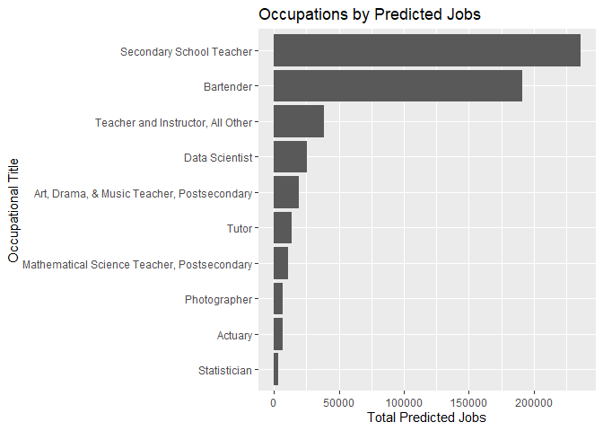<!-- -->

Surprisingly to me, `Secondary School Teacher` tops the list, with
`Bartender` as a close second. I would have expected Bartender to be the
highest, as it requires much less education and training, and is
generally available everywhere.

Next, what skills are required for these occupations? Note that since I
only have 10 occupations, I am measuring the skills by the number of
predicted jobs.

``` r
dfmyocc |> summarize(
  .by = skill_def,
  tot_jobs = sum(projected_employment),
) |> ggplot(aes(x=reorder(skill_def,tot_jobs), y=tot_jobs)) +geom_col() +coord_flip()+labs(x='Top Skill', y='Total Predicted Jobs', title = 'Top Skills by Predicted Jobs')
```

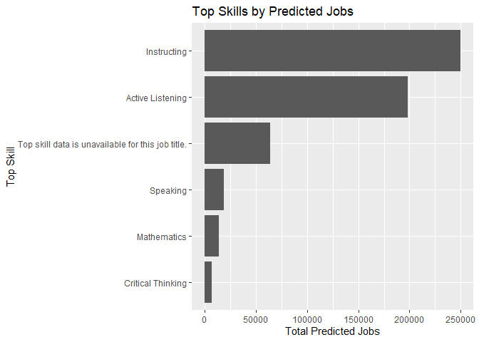<!-- -->

Considering half of my selected occupations are in the education sector,
it isn’t surprising that `Instructing` is the highest on this graph.
Once again, we see `Active Listening` high up there. Ultimately, all of
these skills are useful in the jobs I am looking at, and they are skills
I believe I possess at high levels.

Next, lets look at education requirements. Again, these are based off
the number of predicted jobs.

``` r
dfmyocc |> summarize(
  .by = typical_education_requirement,
  tot_jobs = sum(projected_employment)
)|> ggplot(aes(x=reorder(typical_education_requirement,tot_jobs), y=tot_jobs)) + geom_col() + coord_flip()+labs(x='Education Requirement', y='Total Predicted Jobs', title = 'Minimum Education Requirement by Predicted Jobs')+scale_y_continuous(labels = label_number())
```

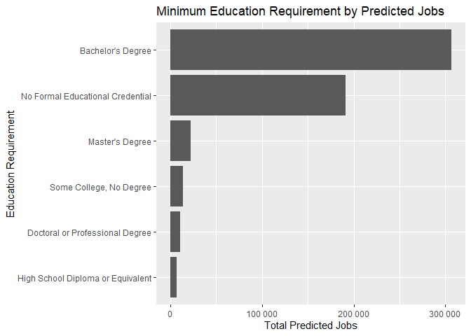<!-- -->

Unsurprisingly, `Bachelor's Degree` and
`No Formal Educational Credential` top the charts. As with the last two
graphs, the large amount of `Secondary School Teacher` and `Bartender`
jobs skew the data. However, it is at least reassuring that the most
jobs require a `Bachelor's Degree`, which is what I am working towards.

Most importantly, I would like to look at annual salary.

``` r
dfmyocc |> summarize(
  .by = occupational_title,
  avg_sal = mean(average_annual_salary, na.rm=T)
) |> ggplot(aes(x=reorder(occupational_title, avg_sal), y=avg_sal))+geom_col()+coord_flip()+labs(x='Occupational Title', y='Average Annual Salary', title = 'Occupations by Annual Salary')
```

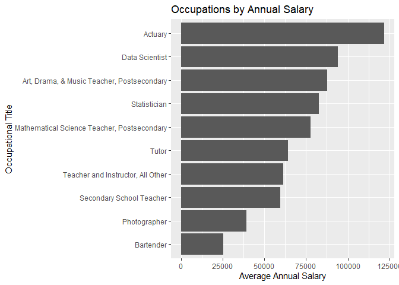<!-- -->

There aren’t a whole lot of surprises here. `Actuary` tops the chart as
expected, and `Bartender` is the lowest.

I do think that `Bartender` is a bit misleading, however. The hourly
wage for bartenders is between \$11-14, which is fairly close to my base
hourly wage of \$10 when I worked as a bartender. My assumption is that
tips are not included in the data in this set, since with tips my hourly
pay averaged around \$15-20 depending on the season.

The biggest surprise to me was
`Art, Drama, & Music Teacher, Postsecondary` having the third highest
salary. I would have expected Statistician to be higher at least.

Another surprise is how high `Tutor` is on the list. Upon further
inspection of the data, `Tutor` is split into two groups. One group has
an average hourly wage of around \$20, which is close to what I
currently make as a tutor. The other group has an average hourly wage of
around \$50, which pulls up the overall average salary quite a bit. So
it looks like the biggest thing I have learned from this project is that
I need to ask for a raise.

## Final Thoughts

Through this data exploration, I have gained some valuable insights into
the job market in Iowa. There are a lot of takeaways from the initial
general exploration, such as `Active Listening` being far and away the
most widely sought skill. However, the analysis centered around my
personal job market was much more impact to me.

I walk away from this project with a lot more confidence. Not only are
the jobs that I am looking at plentiful, but their skills line up with
skills I have built up over the years. It is also super relieving to
know that financially the market doesn’t meaningfully change based on
location.
